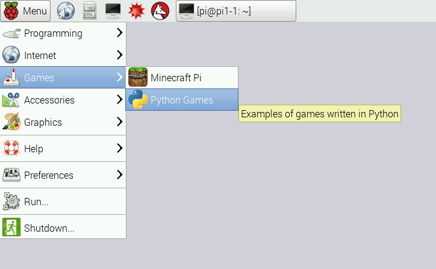

# Fun and Games
Now you know some basics about Python, so we are going to turn you loose with some fun Python games.  Go to the menu button in the upper left corner of the screen and click it.  Choose "Games" and then "Python games".  A screenshot of the menu item is shown below:

Once you click on that item it will bring up a list of games you can play that were written in Python.  Feel free to play those games.  However, if you want to write some code for those games, you can open the Python code in an editor and change them!  If you want to edit the game code, go back to your Python interpreter window and choose "File" and then choose "Open".  Navigate to the "python_games" directory and choose the file that is named the same as the game you want to edit.  When that code comes up, it will be in an editor that you can use to change the code.  Go through the code and try changing some values to see how it affects the game.  
* Can you change the color of the squirrel?  
* Can you make the snake longer to start out?  

Have fun changing the code and be sure to ask questions!
