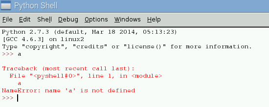

# Welcome
Welcome to programming in Python on the Raspberry Pi!  We put together this tutorial to walk you through the journey of learning the [Python programming language](https://www.python.org) using the [Raspberry Pi](https://www.rasberrypi.org).

Learning an entire programming language is really tough, but don't worry, we have folks available to help you!  We don't expect you to learn all the aspects of programming right here, right now.  We expect you will have questions and will run into problems as you work through these exercises.  That's okay!  Ask questions, work with other students and experts, and make your own learning journey.

If you want to get an electronic copy of these instructions, go to: [https://github.com/jeremyprice/YoungCodersCodeJam/blob/master/BeginnerHandout.md](./BeginnerHandout.md)

This is the first introductory set of activities to get your feet wet with Python on the Raspberry Pi.

# Activities
Follow along with the lessons in this section and we will get you programming in Python on the Raspberry Pi in no time!

## Activity 1  Math
Want to have Python help you with your math homework?  Let's see if Python can do basic arithmetic.  Type the following line into your interpreter, and see what it tells you (remember, you don't have to type the `>>>` the interpreter puts those in for you):

```
>>> 1 + 1
```

Did Python get it right?  Let's try another:

```
>>> 2 * 2
```

What math operation did the `*` perform? (Answer: multiplication)  Did Python get the answer correct?

Try the following two commands:

```
>>> 3 - 2
```

```
>>> 6 / 3
```

Subtraction and Division round out our four basic arithmetic operators.

### Try it!
Try out the mathematical operations on your own, and see if you agree with Python's calculations.  Start at the [next activity](#activity-2--integers-and-decimals) when you are done experimenting.

The mathematical operators are:

| Operation | Operator |
| :---: | :---: |
| Addition | `+` |
| Subtraction | `-` |
| Multiplcation | `*` |
| Division | `/` |

## Activity 2  Integers and Decimals
There are two types of numbers in Python: **integers** and **decimals**.  **Integers** are whole numbers only, like `1, 2, 3, 4, 5`.  **Decimals** are numbers that can have a decimal point in it, like `1.5, 2.3, 4.0`.  The numbers we used in the last section were integers.  However, something strange happens when you use integers for division.  Try asking Python what 3 divided by 2 is:

```
>>> 3 / 2
```

You would expect it to say `1.5`, but it doesn't!  It just says `1`.  That is because Python is doing integer math, which only gives us whole number results.  If you want to get the decimal answer, you have to use decimal numbers.  In Python, a decimal number is called a **float** (which is short for floating point number).  Let's have Python do that last calculation again, this time with decimals (floats).

```
>>> 3.0 / 2.0
```

Did that give the answer you expected?  It should have given you 1.5, because we made those numbers into decimals.  In order to make an integer into a decimal number, you just have to add the decimal point!

### Try it!
Now that you know how to do decimal arithmetic with Python, try using decimals with the other arithmetic operators.

## Activity 3  Comparisons
One of the most powerful things we can do with Python, besides math, is to compare values.  In order to compare numbers, we use comparison operators and ask Python to tell us if it is True or False.  Try entering the following in the Python interpreter:

```
>>> 5 < 3
```

That statement asks Python if the number `5` is less than the number `3`.  We  expect Python to answer `False`.  Did it?

Here is a list of the comparison operators and what comparison they will ask Python to perform:

| Comparison | Operator |
| :---: | :---: |
| Equal to | `==` |
| Not Equal to | `!=` |
| Less than | `<` |
| Greater than | `>` |
| Less than or equal to | `<=` |
| Greater than or equal to | `>=` |

If you want to compare two numbers and check if they are equal, you might type:

```
>>> 6 == 7
```

We expect Python to answer `False`.  Did it?

### Try it!
Now that you know how to compare numbers in Python, try it out!  Try comparing all kinds of numbers and see if you agree with Python's answers.

## Activity 4  Variables
It would be nice if we could store some of the values we are working with in Python.  That way, if we did a big calculation, or some complex arithmetic, we wouldn't have to type it over and over again.  Luckily for us, Python has a mechanism called **variables** that allow us to store values.  If you want to store the number `123` into a variable called `xyz`, you can type the following:

```
>>> xyz = 123
```

What did Python respond with?  (Don't worry if Python didn't say anything.)  If Python was quiet everything worked as expected!  If you want to see the value you stored in a variable, just type the name of the variable into the interpreter and hit enter.

```
>>> xyz
```

Variables can store all kinds of information.  Try putting the result of a calculation into a variable.  Let's store the value of `5 + 5` into the variable `abc`.

```
>>> abc = 5 + 5
>>> abc
```
Did it store `10` in `abc`?  Great!

### Variable names
Your variables can have very complex names, or very simple names, it is completely up to you.  However, you have to follow a few simple rules:

1. your variable name has to start with a letter
1. your variable name can **only** have letters, numbers, or the underscore `_` character


* How long do you think you can make a variable name?
* Can you make a variable named after you (Remember: you can't use a space in your variable name)?

### Try it!
Now that you know how to store things in variables, try it out for yourself!  Try storing complex calculation results, comparison results, or maybe just some really big numbers.

## Activity 5  Strings
In Python, if you want to store and use textual information, we can do so using strings.  Strings are simply words and letters that you put in single quotes `'` or double quotes `"`.  Python takes all those letters and treats them as a single object.  For instance:
```
>>> my_string = "abc123"
```
That code creates a variable called `my_string` and stores the text `abc123` in there.  Notice that it doesn't store the `"` symbol in the variable, the `"` is just a way to tell python "Everything in here is the string".

### Try it!
Create some strings with some fun phrases.  Try creating a joke by setting the variables with the strings that make up the joke.  Make sure you put all your text content in quotes, and leave the variables outside the quotes.

## Activity 6  Exceptions
Sometimes you, or Python, encounters an error in your code.  Whenever Python has an error it generates what is called an **exception**.  Exceptions aren't bad, and they aren't a sign that you broke Python, but they do mean something went wrong.  An example of an exception is shown in the screenshot below:



If you get an exception, take a look at your code and see if you can figure out what went wrong.  If you can't figure it out, feel free to ask one of us for help!  

## Activity 7  Lists
Not only can Python store a single value in a variable, but it can also store a list of values.  A list is a bucket in Python that can hold any number of items, and each of those items can be any type (for example: integers, decimals, and strings).  For instance, we can create a variable called `hhh` in Python that holds a list of first names:
```
>>> hhh = ["Bob", "Larry", "Susan", "Alice"]
```
Notice a list starts and ends with square brackets `[]`.  It also has commas in between the items in the list.  Here is an example with a list of integers:
```
>>> hhh = [1, 5, 6, 7]
```

We can also ask Python for any item in that list.  For instance, if we want to show the first item in the list:
```
>>> hhh[0]
```
Wait, hang on a second, why did we use `0` instead of `1`?  The reason is: in computers, and thus in code, the first element in the list is defined to be at the `0` offset from the start of the list.  If we want to access items in the list the number we use is one less than the number of the item you want to refer to.  (Because computers start counting at 0, not 1 like we do.)  So, to get `Larry` from the `hhh` variable, we would access the element at index 1: `hhh[1]`

### Try it!
Create some lists of integers, decimals, and strings.  Try making a list of your favorite colors, or places you want to visit, or the ages of the people in your family.

# Conclusion
We hope you had fun learning some Python code today.  If you have any questions, please feel free to ask one of our volunteers.  Keep trying out more code with Python, and most importantly: don't give up!  Python can be a lot of fun.

## Links to more information

If you would like more information on the following topics, hit the websites listed:

* [Raspberry Pi](http://www.raspberrypi.org) - http://www.raspberrypi.org
* [Python](https://www.python.org) - https://www.python.org
* [San Antonio Code Jam](http://www.sacodejam.com/) - http://www.sacodejam.com/
